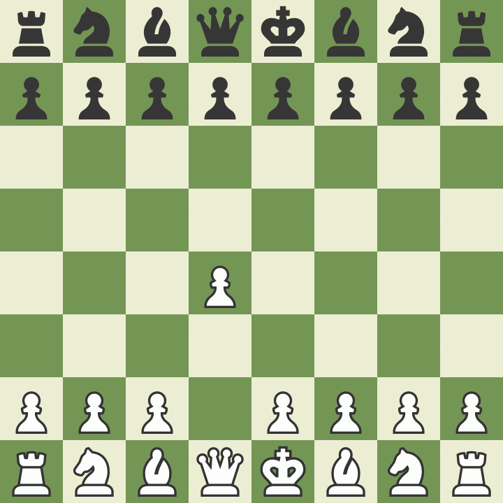

<!-- Animated typing banner -->

# 💫 About Me:
Hey, I’m Aziz 👋  I’m a software developer who enjoys building things that actually solve problems. Most of my work has been around backend development with C#/.NET, APIs, microservices, and cloud tools — but I also like experimenting with AI, automation, and full-stack projects.  Currently finishing my CS degree at Arizona State University while working on projects involving React, TypeScript, Python, Docker, Kubernetes, and machine learning.  A few things I’ve worked on:  * Payment processing microservices handling real-world traffic * AI/AR capstone project where I led the development team * Chrome extension for students to sync and share Canvas assignments * ML models using PyTorch and data analysis pipelines  I like clean architecture, good team workflows, and turning chaotic ideas into working products.  Outside of coding, I’m usually participating in hackathons, learning new tech, or helping organize student communities.  Fun Facts  * Amazon Hackathon Finalist ×2 * Claude Hackathon Winner * Big fan of building side projects at 2am  Always open to collaborating on interesting projects. 

### ♟️ Currently Playing

## 🌐 Socials:
  

# 💻 Tech Stack:
                                                        
# 📊 GitHub Stats:
 
 

### ✍️ Random Dev Quote

### 🐍 Watch My Contributions Get Eaten

---

<!-- Proudly created with GPRM ( https://gprm.itsvg.in ) -->